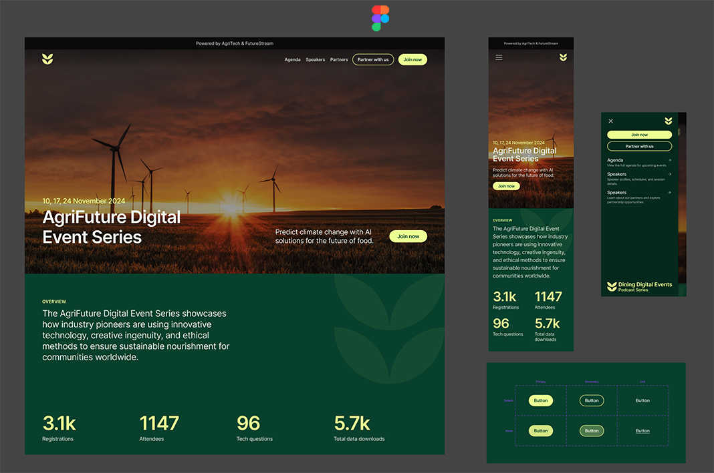
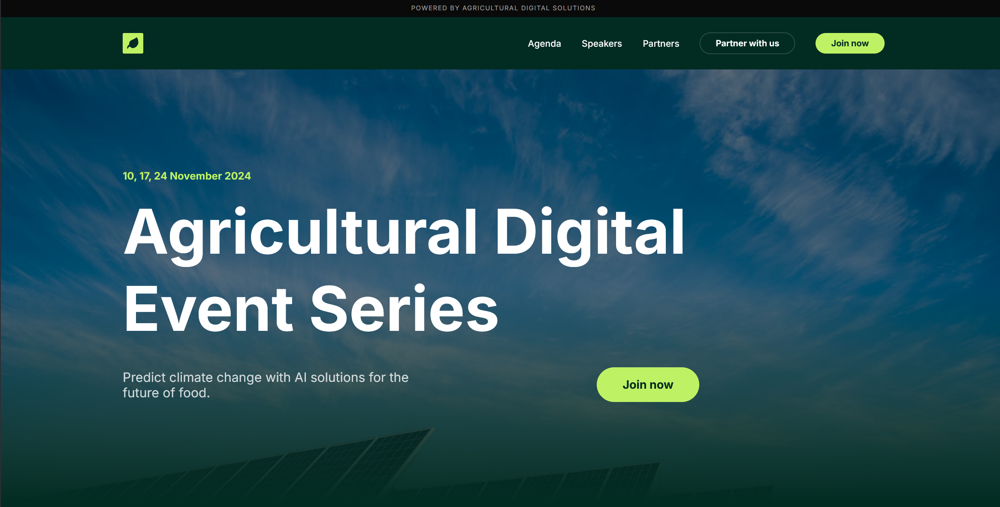

# Agricultural Digital Event Series



A responsive, single-page landing site for the Agricultural Digital Event Series — a conference showcasing innovative technology, AI solutions, and ethical methods for the future of sustainable food production.

Built entirely with **vanilla HTML, CSS, and JavaScript**. Zero build tools, zero frameworks, zero dependencies.

---

## Site Overview



- **Top banner** — Branding strip across the top of the viewport.
- **Sticky header** — Logo + desktop navigation that transitions to a compact, blurred-glass style on scroll.
- **Mobile navigation overlay** — Full-screen slide-in menu for small viewports, with spring-style animation.
- **Hero** — Full-viewport background image with gradient overlay, animated headline, and call-to-action.
- **Overview** — Mission statement with a decorative leaf watermark on desktop.
- **Stats** — Key metrics (registrations, attendees, etc.) that animate in as you scroll.
- **Footer** — Brand, copyright, and legal links.

---

## Project Structure

```
Agtech/
├── index.html   — Semantic markup, inline SVG icons, Google Fonts link
├── styles.css   — All layout, responsive breakpoints, colors, and animations
├── script.js    — Scroll detection, mobile menu, IntersectionObserver animations
├── README.md
└── .gitignore
```

---

## Run Locally

No install step required. Open `index.html` directly in any browser, or use a local static file server for the best experience:

```bash
# Python 3
python -m http.server 3000

# Node.js (npx, no install)
npx serve .
```

Then visit `http://localhost:3000`.

---

## Lighthouse Report & Analysis

Below is a category-by-category breakdown of the approaches used in this site that target strong Lighthouse scores, followed by concrete areas where scores could be improved.

### Performance

**Approaches favoring a high score:**

- **No framework overhead.** The entire site is three small static files (~15 KB total before images). There is no React runtime, no Tailwind CSS build output, and no JavaScript bundler. The browser parses raw HTML and renders immediately.
- **Non-render-blocking script.** `script.js` is loaded at the bottom of `<body>`, so it does not block the initial paint of any visible content.
- **GPU-accelerated animations.** Every animation and transition exclusively uses `transform` and `opacity` — the two CSS properties that the browser composites on the GPU without triggering layout or paint recalculations.
- **Minimal DOM size.** The page has a small, flat DOM tree with no deeply nested component wrappers (a common problem in framework-generated markup).
- **CSS custom properties over repeated values.** Colors are defined once in `:root` and reused, keeping the stylesheet compact.
- **IntersectionObserver over scroll listeners for animations.** The stats section uses `IntersectionObserver` instead of a continuous `scroll` event handler. The observer fires only when elements cross the visibility threshold, which is significantly cheaper than running calculations on every scroll frame.

**Where improvements could be made:**

- **Hero image is unoptimized.** The Unsplash image is loaded at `w=2000` for all viewport sizes. Adding a `srcset` and `sizes` attribute would let smaller screens download a proportionally smaller file, reducing Largest Contentful Paint (LCP) time significantly.
- **No explicit `width` and `height` on the hero image.** Without intrinsic dimensions the browser cannot reserve space before the image loads, which contributes to Cumulative Layout Shift (CLS). Adding `width="2000" height="1333"` (the image's native aspect ratio) would fix this.
- **Google Fonts loaded as render-blocking CSS.** The `<link>` to `fonts.googleapis.com` blocks first paint until the font stylesheet is fetched. Using `font-display: swap` (add `&display=swap` to the URL — already present) helps, but self-hosting the font files or using `<link rel="preload">` would eliminate the round-trip to Google entirely.
- **No resource preloading.** Adding `<link rel="preload" as="image" href="...">` for the hero image and `<link rel="preload" as="style">` for the fonts would let the browser start fetching critical assets earlier in the page lifecycle.
- **No image format optimization.** Serving the hero image in WebP or AVIF (with a `<picture>` fallback) would reduce its byte size by 25–50% at equivalent visual quality.

---

### Accessibility

**Approaches favoring a high score:**

- **Semantic HTML throughout.** The page uses `<header>`, `<nav>`, `<section>`, `<footer>`, and heading hierarchy (`h1` → `h2` → `h3`), giving screen readers a logical document outline.
- **`lang="en"` on the root element.** This tells assistive technology which language the content is in, enabling correct pronunciation.
- **`aria-label` on icon-only buttons.** The mobile menu open and close buttons carry `aria-label="Open menu"` and `aria-label="Close menu"`, so they are announced meaningfully to screen reader users despite having no visible text.
- **High color contrast.** The primary palette — bright lime (`#bef264`) on deep dark green (`#022c22`) — provides a contrast ratio of approximately **10.5:1**, well above the WCAG AAA threshold of 7:1. White text on the dark background exceeds **16:1**.
- **Interactive states are visible.** All links and buttons have explicit `:hover` transitions so keyboard-focused or hovered elements are clearly distinguishable.

**Where improvements could be made:**

- **No skip-to-content link.** Adding a visually hidden "Skip to main content" anchor as the first focusable element would allow keyboard users to bypass the navigation.
- **Mobile menu lacks ARIA state attributes.** The mobile overlay should carry `aria-hidden="true"` when closed and `role="dialog"` + `aria-modal="true"` when open. The hamburger button should have `aria-expanded="false/true"` toggled by JavaScript.
- **Focus trapping in mobile menu.** When the mobile overlay is open, keyboard focus can still tab behind it to the page content. Trapping focus inside the overlay (and returning focus to the trigger on close) is a WCAG requirement for modal-like UI.
- **Missing `<main>` landmark.** Wrapping the hero, overview, and stats sections in a `<main>` element would give screen readers a direct "jump to content" target.
- **Decorative SVGs should be hidden.** The large leaf watermark in the overview section is purely decorative and should carry `aria-hidden="true"` and `role="presentation"` to prevent screen readers from attempting to announce it.

---

### Best Practices

**Approaches favoring a high score:**

- **No console errors.** The JavaScript is defensive — it checks for `IntersectionObserver` support before using it and falls back gracefully.
- **No deprecated web APIs.** The code uses modern, well-supported APIs (`classList`, `IntersectionObserver`, `requestAnimationFrame`).
- **`referrerpolicy="no-referrer"` on external image.** This prevents leaking the page URL to Unsplash when the image is fetched.
- **No third-party scripts.** The only external requests are to Google Fonts and Unsplash. There are no analytics trackers, ad scripts, or third-party iframes that could introduce security or performance issues.

**Where improvements could be made:**

- **Add a Content Security Policy.** A `<meta http-equiv="Content-Security-Policy">` tag (or HTTP header) restricting `script-src`, `style-src`, and `img-src` to known origins would harden the site against XSS.
- **Serve over HTTPS.** Lighthouse flags any non-HTTPS origin. When deployed, the hosting should enforce HTTPS with HSTS headers.
- **Add a favicon.** Browsers request `/favicon.ico` by default; a missing favicon generates a 404 in the network log and a Best Practices deduction.

---

### SEO

**Approaches favoring a high score:**

- **Descriptive `<title>` tag.** "Agricultural Digital Event Series" is concise, unique, and describes the page content.
- **Proper heading hierarchy.** A single `<h1>` for the page title, `<h2>` for sections, `<h3>` for sub-items — Lighthouse checks this structure explicitly.
- **Responsive viewport meta tag.** `<meta name="viewport" content="width=device-width, initial-scale=1.0">` is present, satisfying the mobile-friendly audit.
- **Legible font sizes.** Base body text is `1rem` (16px) and nothing goes below `10px` (the banner), ensuring Lighthouse's "font size" audit passes.

**Where improvements could be made:**

- **Add a `<meta name="description">` tag.** This is the single highest-impact missing SEO element. Lighthouse specifically flags its absence. A recommended addition:
  ```html
  <meta name="description" content="Join the Agricultural Digital Event Series — a conference exploring AI, climate technology, and sustainable food innovation." />
  ```
- **Add Open Graph and Twitter Card meta tags.** These control how the page appears when shared on social platforms and are increasingly used by search engines for rich results.
- **Add structured data (JSON-LD).** An `Event` schema block would make the page eligible for rich results in Google Search, displaying dates, location, and registration links directly in search listings.
- **Replace `#` placeholder links.** The footer's Privacy Policy and Terms of Service links point to `#`, which Lighthouse flags as non-crawlable. They should point to real pages or be removed.

---

### Summary of Expected Scores

- **Performance: ~85–92** — Excellent for a static site; held back mainly by the unoptimized external hero image and render-blocking font CSS.
- **Accessibility: ~88–95** — Strong semantic foundation; loses points on missing ARIA states for the mobile menu and lack of skip-nav / focus management.
- **Best Practices: ~92–100** — Very clean; minor deductions possible for missing favicon and CSP.
- **SEO: ~90–100** — Solid structure; the missing `<meta description>` is the primary deduction.

All suggested improvements above are additive — they can be applied without restructuring the existing code.
